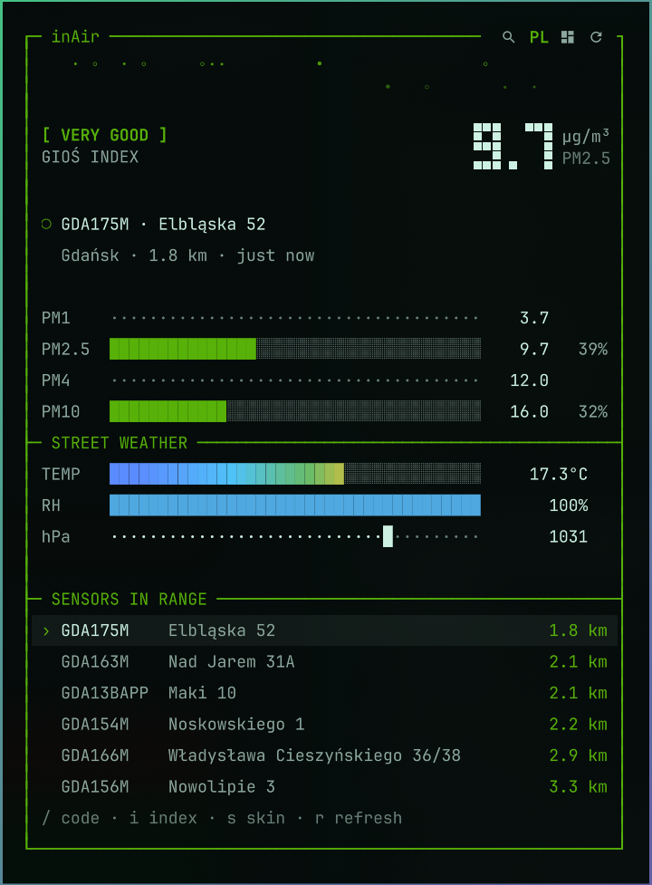

# inAir

Street-level air quality on your Omarchy bar, read from the sensor on the
parcel locker down the street.



> **Unofficial.** inAir is an independent hobby project. It is not made,
> endorsed, sponsored or supported by InPost S.A., and its author has no
> connection with the company. It only reads air quality data that InPost
> publishes openly on its website. "InPost" and "Paczkomat" are trademarks of
> InPost S.A. and appear here only to say where the data comes from.

## Where the data comes from

In October 2021 InPost started fitting air quality sensors to its Paczkomat®
parcel lockers. The first went up on 18 October 2021, on new lockers in cities
that are partners in its *InPost Green City* programme. The company presented
them as part of its anti-smog and climate effort, next to the point that
delivering to a locker means fewer van trips through town
([press release, in Polish](https://inpost.pl/sites/default/files/docs/dla-prasy/20211020_SIEC_PACZKOMATOW_INPOST_PRZEKROCZYLA_15000.pdf)).
The sensors have since spread to a great many lockers across Poland. Each one
reports particulate matter, and many also report temperature, humidity and
pressure. InPost shows the readings in its own app and on each locker's public
page.

inAir finds the nearest locker that has a sensor, shows PM2.5 on the bar
coloured by the air quality index, and opens a panel with everything the
sensor publishes: PM1, PM2.5, PM4 and PM10 (with how much of the legal norm
each one is using), plus temperature, humidity and pressure. These come from a
street corner, not an average for the whole city.

It works wherever there is a sensor, which in practice means Poland.

## Install

```bash
omarchy plugin add https://github.com/priard/omarchy-inair --enable --yes
```

The widget lands in the centre of the bar. Move it with
`omarchy bar move priard.inair --section right`.

It needs a location to start from, and takes it from the one Omarchy already
stores for the weather widget (`~/.local/state/omarchy/settings/weather.json`).
If you have never set one, either set it in the Weather widget's panel or pin a
locker code yourself (see Configure). This plugin never looks up your location
from your IP address.

### Coming from InPost Air 0.3.0?

The plugin was renamed in 0.4.0, and its id changed from `priard.inpost-air`
to `priard.inair`. Remove the old one and add the new one:

```bash
omarchy plugin remove priard.inpost-air --yes
omarchy plugin add https://github.com/priard/omarchy-inair --enable --yes
```

Settings were stored under the old id. If you had changed any, set them again
with `omarchy bar set priard.inair …`.

## Usage

The pill shows PM2.5 in µg/m³, coloured by the air quality index:

| Colour | Polish index (GIOŚ) | European index (EEA) |
|---|---|---|
| green / cyan | Very good | Good |
| light green / teal | Good | Fair |
| yellow | Moderate | Moderate |
| orange / red | Sufficient | Poor |
| red / crimson | Bad | Very poor |
| maroon / purple | Very bad | Extremely poor |

The colours are the official ones, adjusted to stay readable on your theme.
Each one keeps its hue but is darkened or lightened just enough to reach a
minimum contrast against the actual bar and panel background, so GIOŚ yellow
on a light theme and its maroon on a dark one no longer disappear.

- **Left-click** opens the panel.
- **Right-click** switches between the Polish (GIOŚ) and European (EEA) index.
- **Middle-click** refreshes immediately.

Inside the panel, the header buttons and their keys:

| Button | Key | Does |
|---|---|---|
| 󰍉 | `/` or `c` | Opens a field for a locker code, e.g. `KRA80M`. Enter accepts, Escape cancels. The locker can be anywhere in Poland; it does not have to be in range. |
| `PL` / `EU` | `i` | Shows which index is in use; click to switch. |
| 󰕮 / 󰆍 | `s` | Switches between the terminal and the plain skin. |
| 󰑐 | `r` | Refreshes the readings and re-scans for sensors nearby. Spins while it works. |

Hover a button for a tooltip. A switch takes effect immediately and is saved
to `shell.json`, so it survives a restart.

- **Click any locker** in "Sensors in range" to pin it. "Follow the nearest
  sensor" goes back to picking automatically.
- A code typed by hand is looked up by code, so it works for a locker in a town
  you are not in. That is handy for checking somewhere before you drive there.

### Skins

The default **terminal** skin draws the panel as a character grid: one
monospace cell per column, box-drawing for the frame, block characters for the
meters.

```
┌─ inAir ─────────────────────── ⌕ PL ▦ ↻ ─┐
│                 ∘            · ·         │
│    ∙  ·       ∘  ∘               ·  ∙    │
│ [ VERY GOOD ]                  9.7 µg/m³ │
│ GIOŚ INDEX                         PM2.5 │
│                                          │
│ ○ GDA175M · Elbląska 52                  │
│   Gdańsk · 1.8 km · just now             │
│                                          │
│ PM1    ····················    3.7       │
│ PM2.5  ████████░░░░░░░░░░░░    9.7   39% │
│ PM4    ····················   12.0       │
│ PM10   ██████░░░░░░░░░░░░░░   16.0   32% │
│ TREND  █▆▇▅▂▂▃▁              last 40 min │
├─ STREET WEATHER ─────────────────────────┤
│ TEMP   █████████████░░░░░░░     17.3°C ↑ │
│ RH     ██████████████████░░        92% → │
│ hPa    ··············█·····       1031 ↓ │
│                                          │
├─ SENSORS IN RANGE ───────────────────────┤
│ › GDA175M    Elbląska 52          1.8 km │
│   GDA163M    Nad Jarem 31A        2.1 km │
│ / code · i index · s skin · r refresh    │
└──────────────────────────────────────────┘
```

In the panel itself the rows have more space between them than this text
version shows, and PM2.5 is drawn large in square pixel digits.

- **Air flow.** The two rows under the title are particles drifting past. The
  dirtier the air, the denser the drift: a few dots on a clean day, a haze
  past the norm. The animation only runs while the panel is open.
- **Meters.** The filled run is the share of the legal norm (PM2.5 against
  25 µg/m³, PM10 against 50). Past 100% the bar is full and the number tells
  the rest. PM1 and PM4 have no legal norm, so they get a dotted track.
- **Trend.** A sparkline of PM2.5 over the readings gathered since the shell
  started. It is kept in memory only and starts over when you switch lockers.
- **Street weather**, in the same block cells as the meters. Temperature is a
  heat strip on a −20…40 °C scale, each cell coloured by the temperature it
  stands for, from cold blue to hot red. Humidity fills 0–100%. Pressure is a
  single block on a dotted 970–1050 hPa ruler. Each row has an arrow showing
  which way the value has been moving.

The **plain** skin shows the same content in ordinary widgets, with soft
motes drifting behind the headline instead of the particle rows. There are
more of them when the air is worse.

Readings refresh every five minutes. A failed refresh leaves the last reading
on screen rather than blanking the bar.

## Configure

Settings live in the widget's entry in `~/.config/omarchy/shell.json` and take
effect on save, whether you edit the file by hand or use `omarchy bar set`:

```bash
omarchy bar set priard.inair locker KRA80M   # pin one locker
omarchy bar set priard.inair locker ""       # back to the nearest sensor
omarchy bar set priard.inair index european
omarchy bar set priard.inair style plain
```

```json
{ "id": "priard.inair", "locker": "", "index": "polish", "style": "terminal", "refreshMinutes": 5 }
```

| Key | Default | Meaning |
|---|---|---|
| `locker` | `""` | Locker code to pin, e.g. `"KRA80M"`. Empty follows the nearest sensor. |
| `index` | `"polish"` | `"polish"` for the GIOŚ scale, `"european"` for the EEA one. |
| `style` | `"terminal"` | `"terminal"` for the character-grid skin, `"plain"` for ordinary widgets. |
| `refreshMinutes` | `5` | How often to re-read the sensor, clamped to 1–60. |
| `resolvedCode`, `resolvedId` | — | Written by the plugin: the locker it settled on and its numeric id, so the next session skips discovery. Delete them to force a fresh look. |

Not every locker with a sensor has a public page, and without that page there
is no numeric id and so no readings. When that happens the plugin moves on to
the next sensor in range instead of reporting a failure.

## What it talks to, and what it writes

Three public InPost endpoints. No account, no API key, no credential of any
kind:

| Endpoint | When | What for |
|---|---|---|
| `GET api-shipx-pl.easypack24.net/v1/points?relative_point=…` | on discovery, at most hourly | which lockers near you have a sensor |
| `GET inpost.pl/<locker-page>` | once per locker, then cached | the locker's numeric id |
| `POST inpost.pl/shipx-point-data/<id>/<code>/air_index_level` | every `refreshMinutes` | the readings |

Your coordinates go to InPost's locker search, the same way they would if you
used their locker finder. Nothing else leaves the machine. Requests identify
themselves with the user agent `omarchy-inair`.

Every request goes through `bin/inair-fetch`. It only accepts arguments that
match fixed patterns, refuses redirects and proxies, caps the size of every
response, and kills the request after a deadline.

Files: the plugin **writes nothing outside its own entry in `shell.json`**. It
reads `~/.local/state/omarchy/settings/weather.json` (Omarchy's own location
file) and never modifies it. The trend history is kept in memory only.

## Remove

```bash
omarchy plugin remove priard.inair
```

That deletes the plugin and its bar entry. Nothing else is left behind: no
state files, no cache, no daemon, no system configuration. The only trace is
the settings block inside `~/.config/omarchy/shell.json`, which goes with the
bar entry. No privileges were granted, so none need revoking.

## Credit

The endpoints were mapped by [CyberDeer's InPost-Air](https://github.com/CyberDeer/InPost-Air)
Home Assistant integration. The index thresholds come from
[GIOŚ](https://powietrze.gios.gov.pl/pjp/content/health_informations) and the
[EEA](https://www.eea.europa.eu/themes/air/air-quality-index). The sensors and
their data belong to InPost; this plugin only displays them.

## License

MIT. See [LICENSE](LICENSE).
