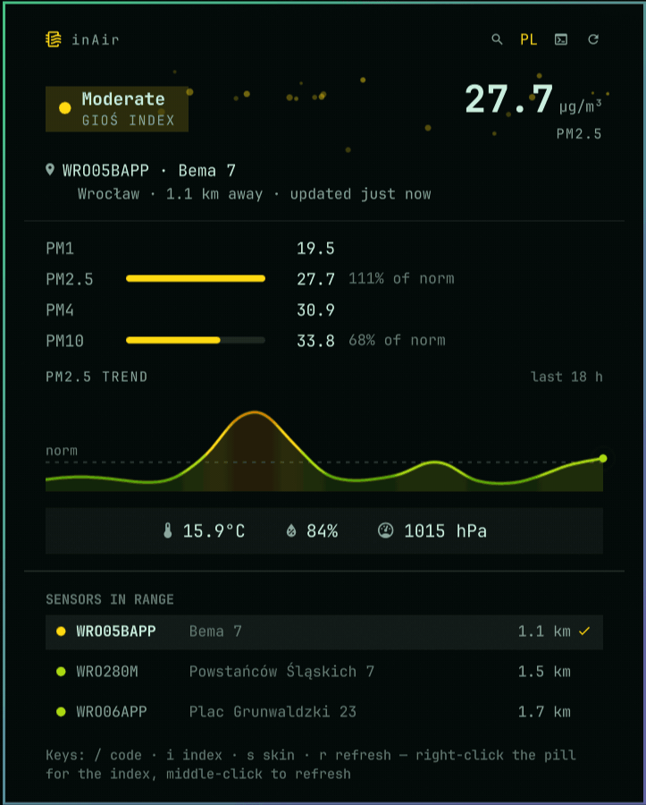

# inAir

Street-level air quality on your Omarchy bar, read from the sensor on the
parcel locker down the street.


<sub>Screenshots show a sensor in Wrocław and a made-up trend, for illustration.</sub>

> **Unofficial.** inAir is an independent hobby project. It is not made,
> endorsed, sponsored or supported by InPost S.A., and its author has no
> connection with the company. It only reads air quality data that InPost
> publishes openly on its website. "InPost" and "Paczkomat" are trademarks of
> InPost S.A. and appear here only to say where the data comes from.

> [!WARNING]
> **Readings are blocked by InPost (since 7 October 2026).** The endpoint that
> serves the sensor readings (`inpost.pl/shipx-point-data/…`) now sits behind a
> Cloudflare rule that refuses any request not made by the inpost.pl website
> itself, with HTTP 403. inAir therefore gets no readings: the pill shows
> `󰵃 —`, and the panel says that InPost is blocking automated access. Finding
> lockers and sensors still works, because that part of InPost's API is open.
>
> There is nothing to fix on your side, and inAir will not try to get around
> the block by pretending to be a browser. If InPost opens access again, the
> readings come back on their own, without an update. InPost has published
> nothing about the change; the same block broke the
> [InPost Air Home Assistant integration](https://github.com/CyberDeer/InPost-Air/issues/130).
> For this reason, removal of inAir from the Omarchy plugin marketplace has
> been requested.

## Where the data comes from

In October 2021 InPost started fitting air quality sensors to its Paczkomat®
parcel lockers. The first went up on 18 October 2021, on new lockers in cities
that are partners in its *InPost Green City* programme. The company presented
them as part of its anti-smog and climate effort, next to the point that
delivering to a locker means fewer van trips through town
([press release, in Polish](https://inpost.pl/sites/default/files/docs/dla-prasy/20211020_SIEC_PACZKOMATOW_INPOST_PRZEKROCZYLA_15000.pdf)).
The sensors have since spread to a great many lockers across Poland. Each one
reports particulate matter, and many also report temperature, humidity and
pressure. InPost shows the readings in its own app and on each locker's public
page.

inAir finds the nearest locker that has a sensor, shows PM2.5 on the bar
coloured by the air quality index, and opens a panel with everything the
sensor publishes: PM1, PM2.5, PM4 and PM10 (with how much of the legal norm
each one is using), plus temperature, humidity and pressure. These come from a
street corner, not an average for the whole city.

It works wherever there is a sensor, which in practice means Poland.

## Install

```bash
omarchy plugin add https://github.com/priard/omarchy-inair --enable --yes
```

The widget lands in the centre of the bar. Move it with
`omarchy bar move priard.inair --section right`.

### Finding a sensor

inAir looks for the sensors nearest to you, and needs something to measure
"nearest" from. It uses the location Omarchy stores for the weather widget
(`~/.local/state/omarchy/settings/weather.json`), but **by default Omarchy
stores none:** the weather follows your IP address, and a location set by name
alone has no coordinates. Then the pill shows `󰵃 —` and the panel says what is
missing. Any one of these gets it going:

- **Type your postcode.** Open the panel, press `/`, type e.g. `31-042` and
  press Enter. The panel lists the sensors nearest to that postcode, with
  distances, and starts reading the nearest one. The postcode is not stored;
  the locker it found is, so the reading survives a restart.
- **Set your location in the Weather widget.** Click the location in the
  weather panel, type your town and pick it from the suggestions; that stores
  coordinates. inAir notices within a minute and lists the sensors around you.
- **Type a locker code**, e.g. `KRA80M`, the same way. It pins that locker and
  lists the sensors around it.
- From a terminal:

  ```bash
  omarchy-weather-location --set "Kraków" 50.0614,19.9366   # name, then lat,lon
  omarchy bar set priard.inair locker KRA80M                # or pin a locker
  ```

The search looks at the 300 nearest lockers, which reaches about 10 km from a
village and a few km in a city. This plugin never looks up your location from
your IP address.

### Update

```bash
omarchy plugin update priard.inair
```

This fetches the latest version from GitHub, shows what changed and asks
before applying it. Add `--yes` to skip the question, or leave out the id to
update every git-installed plugin at once. The new version is validated
before it is kept; if validation fails, the update is rolled back. The update
only fast-forwards, so it refuses to run if you have edited the plugin's files
locally. Your settings in `shell.json` are kept.

The shell reloads the plugin when its files change, but it can keep parts of
the old version cached. If the panel still looks the same after an update,
restart the shell:

```bash
omarchy-restart-shell
```

See [CHANGELOG.md](CHANGELOG.md) for what each version changed.

### Coming from InPost Air 0.3.0?

The plugin was renamed in 0.4.0, and its id changed from `priard.inpost-air`
to `priard.inair`. Remove the old one and add the new one:

```bash
omarchy plugin remove priard.inpost-air --yes
omarchy plugin add https://github.com/priard/omarchy-inair --enable --yes
```

Settings were stored under the old id. If you had changed any, set them again
with `omarchy bar set priard.inair …`.

## Usage

The pill shows PM2.5 in µg/m³, coloured by the air quality index:

| Colour | Polish index (GIOŚ) | European index (EEA) |
|---|---|---|
| green / cyan | Very good | Good |
| light green / teal | Good | Fair |
| yellow | Moderate | Moderate |
| orange / red | Sufficient | Poor |
| red / crimson | Bad | Very poor |
| maroon / purple | Very bad | Extremely poor |

The colours are the official ones, adjusted to stay readable on your theme.
Each one keeps its hue but is darkened or lightened just enough to reach a
minimum contrast against the actual bar and panel background, so GIOŚ yellow
on a light theme and its maroon on a dark one no longer disappear.

- **Left-click** opens the panel.
- **Right-click** switches between the Polish (GIOŚ) and European (EEA) index.
- **Middle-click** refreshes immediately.

Inside the panel, the header buttons and their keys:

| Button | Key | Does |
|---|---|---|
| 󰍉 | `/` or `c` | Opens the search field. A **postcode** (`31-042`) lists the sensors around it and reads the nearest if nothing is being read yet; a **locker code** (`KRA80M`) pins that locker, anywhere in Poland, and lists the sensors around it. Enter searches, Escape cancels. |
| `PL` / `EU` | `i` | Shows which index is in use; click to switch. |
| 󰕮 / 󰆍 | `s` | Switches between the terminal and the plain skin. |
| 󰑐 | `r` | Refreshes the readings and re-scans for sensors nearby. Spins while it works. |

Hover a button for a tooltip. A switch takes effect immediately and is saved
to `shell.json`, so it survives a restart.

- **Click any locker** in "Sensors in range" to pin it. "Follow the nearest
  sensor" goes back to picking automatically.
- A code typed by hand is looked up by code, so it works for a locker in a town
  you are not in. That is handy for checking somewhere before you drive there.

### Skins

The default **terminal** skin draws the panel as a character grid: one
monospace cell per column, box-drawing for the frame, block characters for the
meters.

```
┌─ inAir ─────────────────────── ⌕ PL ▦ ↻ ─┐
│                 ∘            · ·         │
│    ∙  ·       ∘  ∘               ·  ∙    │
│ [ VERY GOOD ]                  9.7 µg/m³ │
│ GIOŚ INDEX                         PM2.5 │
│                                          │
│ ○ GDA175M · Elbląska 52                  │
│   Gdańsk · 1.8 km · just now             │
│                                          │
│ PM1    ····················    3.7       │
│ PM2.5  ████████░░░░░░░░░░░░    9.7   39% │
│ PM4    ····················   12.0       │
│ PM10   ██████░░░░░░░░░░░░░░   16.0   32% │
│ TREND  █▆▇▅▂▂▃▁              last 40 min │
├─ STREET WEATHER ─────────────────────────┤
│ TEMP   █████████████░░░░░░░     17.3°C ↑ │
│ RH     ██████████████████░░        92% → │
│ hPa    ··············█·····       1031 ↓ │
│                                          │
├─ SENSORS IN RANGE ───────────────────────┤
│ › GDA175M    Elbląska 52          1.8 km │
│   GDA163M    Nad Jarem 31A        2.1 km │
│ / code · i index · s skin · r refresh    │
└──────────────────────────────────────────┘
```

In the panel itself the rows have more space between them than this text
version shows, and PM2.5 is drawn large in square pixel digits.

- **Air flow.** The two rows under the title are particles drifting past. The
  dirtier the air, the denser the drift: a few dots on a clean day, a haze
  past the norm. The animation only runs while the panel is open.
- **Meters.** The filled run is the share of the legal norm (PM2.5 against
  25 µg/m³, PM10 against 50). Past 100% the bar is full and the number tells
  the rest. PM1 and PM4 have no legal norm, so they get a dotted track.
- **Trend.** A sparkline of PM2.5 over the last hours, up to a day. Each cell
  is an average over an equal slice of time, so a night with the laptop asleep
  shows as a flat stretch, not a jump. Each cell is coloured by the index it
  stood at in its own slice of time, worked out from that slice's PM2.5 and
  PM10 on the scale in use, so a smoggy morning stays red after the air has
  cleared. Only those two values are stored, so a cell can now and then differ
  from the level InPost showed at the time. The readings are kept in a small
  private file (see below), so a shell restart or a plugin update does not
  wipe the trend. Each locker has its own trend, and the four used most
  recently are kept, so a look at another locker does not cost you yours.
- **Street weather**, in the same block cells as the meters. Temperature is a
  heat strip on a −20…40 °C scale, each cell coloured by the temperature it
  stands for, from cold blue to hot red. Humidity fills 0–100%. Pressure is a
  single block on a dotted 970–1050 hPa ruler. Each row has an arrow showing
  which way the value has been moving.

The **plain** skin shows the same content in ordinary widgets, with soft motes
drifting behind the headline instead of the particle rows; there are more of
them when the air is worse. Its counterpart to the sparkline is an area chart
of PM2.5 over the same stored history: a smooth curve whose colour follows the
index along time, a dashed line at the legal norm (25 µg/m³), a pulsing dot
for the latest reading, and, under the pointer, the value and the time it was
measured.



Readings refresh every five minutes. A failed refresh leaves the last reading
on screen rather than blanking the bar.

## Configure

Settings live in the widget's entry in `~/.config/omarchy/shell.json` and take
effect on save, whether you edit the file by hand or use `omarchy bar set`:

```bash
omarchy bar set priard.inair locker KRA80M   # pin one locker
omarchy bar set priard.inair locker ""       # back to the nearest sensor
omarchy bar set priard.inair index european
omarchy bar set priard.inair style plain
```

```json
{ "id": "priard.inair", "locker": "", "index": "polish", "style": "terminal", "refreshMinutes": 5 }
```

| Key | Default | Meaning |
|---|---|---|
| `locker` | `""` | Locker code to pin, e.g. `"KRA80M"`. Empty follows the nearest sensor. |
| `index` | `"polish"` | `"polish"` for the GIOŚ scale, `"european"` for the EEA one. |
| `style` | `"terminal"` | `"terminal"` for the character-grid skin, `"plain"` for ordinary widgets. |
| `refreshMinutes` | `5` | How often to re-read the sensor, clamped to 1–60. |
| `resolvedCode`, `resolvedId` | — | Written by the plugin: the locker it settled on and its numeric id, so the next session skips discovery. Delete them to force a fresh look, but see below. |

Not every locker with a sensor has a public page, and without that page there
is no numeric id and so no readings. When that happens the plugin moves on to
the next sensor in range instead of reporting a failure. InPost also takes
pages down now and then while the sensor keeps reporting; a locker whose id is
already cached keeps working, which is one more reason not to delete
`resolvedId` without need.

## What it talks to, and what it writes

Public InPost endpoints only. No account, no API key, no credential of any
kind:

| Endpoint | When | What for |
|---|---|---|
| `GET api-shipx-pl.easypack24.net/v1/points?relative_point=…` | on discovery, at most hourly; after a locker code is typed | which lockers near you, or near that locker, have a sensor |
| `GET api-shipx-pl.easypack24.net/v1/points?relative_post_code=…` | when you search a postcode | which lockers near that postcode have a sensor |
| `GET api-shipx-pl.easypack24.net/v1/points/<code>` | when you type or pin a locker code | that locker's address, location and whether it has a sensor |
| `GET inpost.pl/<locker-page>` | once per locker, then cached | the locker's numeric id |
| `POST inpost.pl/shipx-point-data/<id>/<code>/air_index_level` | every `refreshMinutes` | the readings |

Your coordinates, or a postcode you search for, go to InPost's locker search,
the same way they would if you used their locker finder. Nothing else leaves the machine. Requests identify
themselves with the user agent `omarchy-inair`.

Every request goes through `bin/inair-fetch`. It only accepts arguments that
match fixed patterns, refuses redirects and proxies, caps the size of every
response, and kills the request after a deadline. What a request is about
(coordinates, a postcode, a locker code) never appears on a command line,
where any user of the machine could read it in `/proc`: the widget hands it to
the helper on stdin, and the helper hands the URL to curl the same way.

Files:

| Path | Access | What |
|---|---|---|
| `~/.config/omarchy/shell.json` | its own entry only | settings, and the resolved locker id |
| `~/.local/state/omarchy/settings/weather.json` | read only | Omarchy's location, never modified |
| `~/.local/state/priard.inair/history.json` | read and write | the trend: for the four lockers used most recently, their codes and readings from the last 24 hours |

The trend file is the only file the plugin creates. It is small (at most four
lockers of 320 readings each, capped at 256 KiB) and drops anything older than
a day on every write; when a fifth locker comes along, the one read least
recently goes. Because locker codes say roughly where you are and where you
looked, it is private from the moment it is created: mode 0600 in a 0700
directory. All access goes through `bin/inair-history`, which refuses a
symlink, a FIFO, a file someone else owns or one that is too large, and writes
through a fresh temporary file that is renamed over the old one. Readings and
locker codes travel to it on stdin, never on the command line.

## Remove

```bash
omarchy plugin remove priard.inair
```

That deletes the plugin and its bar entry, including its settings block in
`~/.config/omarchy/shell.json`. There is no daemon, cache or system
configuration to clean up, and no privileges were granted, so none need
revoking.

One file survives removal: the trend history,
`~/.local/state/priard.inair/history.json`, which holds up to four locker
codes and a day of readings for each. Delete it, and its directory, yourself if you want no trace
left:

```bash
rm ~/.local/state/priard.inair/history.json
rmdir ~/.local/state/priard.inair
```

## Credit

The endpoints were mapped by [CyberDeer's InPost-Air](https://github.com/CyberDeer/InPost-Air)
Home Assistant integration. The index thresholds come from
[GIOŚ](https://powietrze.gios.gov.pl/pjp/content/health_informations) and the
[EEA](https://www.eea.europa.eu/themes/air/air-quality-index). The sensors and
their data belong to InPost; this plugin only displays them.

## License

MIT. See [LICENSE](LICENSE).
